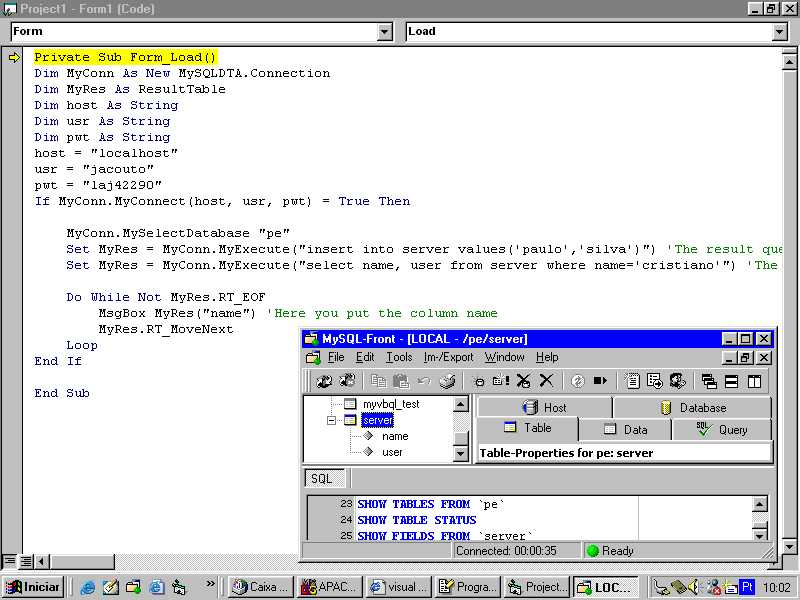



## MySQL Data Access Class Updated

### Description

BUG correction!!! Version 1.01

A solution for who does not want to use ADO/DAO or ODBC to have access its database in MySQL. With only one DLL you it has the power on all functionalities of the MySQL.
 
### More Info
 

             |
---                |---
**Submitted On**   |2002-08-22 13:57:00
**By**             |[Cristiano Couto\.](https://github.com/Planet-Source-Code/PSCIndex/blob/master/ByAuthor/cristiano-couto.md)
**Level**          |Advanced
**User Rating**    |5.0 (40 globes from 8 users)
**Compatibility**  |VB 5\.0, VB 6\.0
**Category**       |[Databases/ Data Access/ DAO/ ADO](https://github.com/Planet-Source-Code/PSCIndex/blob/master/ByCategory/databases-data-access-dao-ado__1-6.md)
**World**          |[Visual Basic](https://github.com/Planet-Source-Code/PSCIndex/blob/master/ByWorld/visual-basic.md)
**Archive File**   |[MySQL\_Data126504942002\.zip](https://github.com/Planet-Source-Code/cristiano-couto-mysql-data-access-class-updated__1-38649/archive/master.zip)

